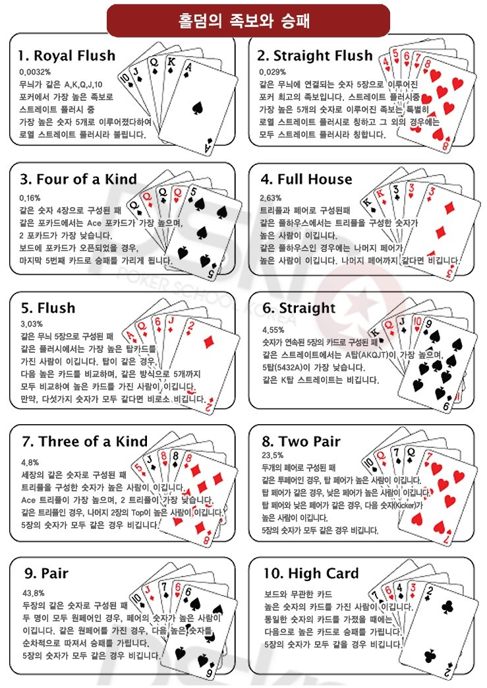

# 창의적 IT 공학설계입문 프로젝트

## 텍사스 홀덤

### 팀원 소개
| 학번 | 이름 | 역할 |
| :---: | :---: | :---: |
| 201711448 | 이도영 | 팀장, 인터페이스 구현|
| 201716905 | 김강민 | 게임진행구현(전체+플레이어)|
| 201716918 | 범진혁 | 카드, 족보파트|
| 201716946 | 임정훈 | 게임진행구현(컴퓨터), 홈페이지 제작|

### 팀 규칙

1. 조 활동 및 회의 시 시간준수 (지각 시 1분당 500원)
2. 브레인스토밍 시간에 본인 의견 2번 이상 내기, 의견 충돌 시 투표로 의견 결정
3. 서로의 프로젝트나 아이디어에 대해 검토, 수정 도와주고 피드백 해주기
4. 자신이 맡은 파트 이외의 코드를 바꿀때, 담당자에게 확인 후 수정
5. 군대얘기 금지 및 복학생 티내지 않기 

[R.S Team Project](https://imjeonghun.github.io/)

[프로젝트 일정](https://github.com/Lee-do-yeong/R.S/wiki/프로젝트-일정)

windows 버전에서만 가능

visual studio 2019

------------------------------------

# 텍사스 홀덤 소개

트럼프 카드로 즐기는 가장 대표적인 '커뮤니티 카드 포커' 게임이다.

## 게임룰

1. 플레이어들은 개인별 손패 2장의 카드를 받는다.
2. 모든 플레이어들이 공유하는 커뮤니티 카드 5장이 주어진다.
3. 커뮤니티 카드 5장과 개인별 손패 2장의 카드의 조합이 가장 높은 플레이어가 승리한다.

## 플레이 방법

1. 족보는 보통의 영어권 표준 족보를 사용한다.
2. 모든 플레이어는 똑같은 금액으로 기본배팅을 한다.
3. 커뮤니티 카드는 먼저 3장을 개봉하고 1차배팅이 이루어진다.
4. 커뮤니티 카드의 4번째 카드 개봉 후 2차 배팅이 이루어진다.
5. 커뮤니티 카드의 5번째 카드 개봉 후 3차 배팅이 이루어진다.

## 족보

